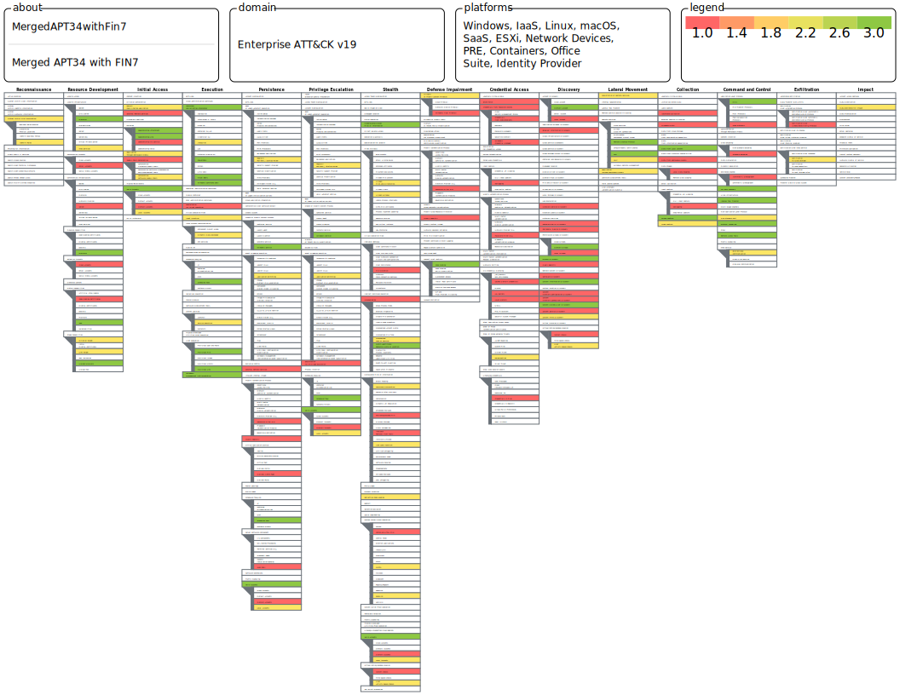

# APT34 and FIN7 Threat Actor Analysis

## Overview
Two financially motivated threat actors
mapped to identify overlapping attack
techniques as highest priority detection
targets.

APT34 (OilRig): Iranian threat actor
targeting Middle East financial
institutions and government.

FIN7: Financially motivated group
targeting banking and retail globally.

## Coverage Map

## Colour Legend
Red    = Used by BOTH actors (33 techniques)
         Highest detection priority
Green  = FIN7 specific (34 techniques)
Yellow = APT34 specific (49 techniques)

## Why These Two Actors
Both target financial sector customers
which aligns with my delivery experience
at Riverbed Technology and ExtraHop experience.

## Detection Rules Built from This Analysis
Rules targeting overlap techniques:
T1053.005 Scheduled Task
T1082     System Information Discovery
T1033     System Owner Discovery
T1059.001 PowerShell (in progress)
T1047     WMIC Execution (in progress)
T1078     Valid Accounts (in progress)

See wazuh/ and sigma/ folders for
complete detection rule implementations.
